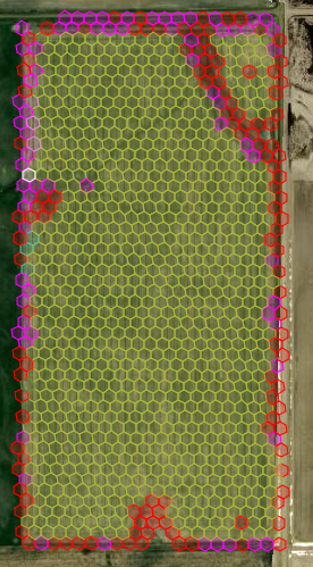
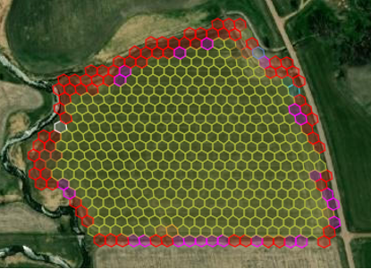

# Field Boundary Detection using Unsupervised Learning

This is just an explorary test, initially done to study the parquet files generated for another project.

With a unsupervised clustering method we were able to detect in most cases the field boundaries, specially
those with greater percentage of the hex located outside the field.

Some samples of the results are presented in the images below.

